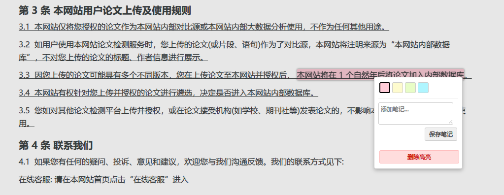

# InkFlow (墨韵) - 增强版 🖋️✨

[](https://github.com/Liu8Can/InkFlow/releases)
[](https://github.com/Liu8Can/InkFlow/stargazers)
[](https://github.com/Liu8Can/InkFlow/network/members)
[](LICENSE)
[](https://github.com/Liu8Can/InkFlow/commits/main)

**「墨韵」** 结合了墨水与韵律，寓意优雅地标记和记录信息；**「InkFlow」** 传达出流动的墨水，象征着信息的记录与展示。

**本项目基于 [raylanb 的原始 InkFlow 项目](https://github.com/raylanb/InkFlow) 进行开发，并在其基础上进行了显著的功能增强和代码优化，旨在提供一个更强大、更稳定、交互更友好的网页高亮与笔记工具。**

在信息爆炸的时代，每天都有大量网页内容供我们浏览，而快速定位、回顾并注释这些信息常常成为挑战。**InkFlow (墨韵) 增强版** 是一个专为高效管理网页信息而设计的 Chrome / Edge 扩展，让您可以轻松高亮网页内容、添加笔记，并确保这些信息被可靠地保存和恢复。

## ✨ 主要特性与优势 (对比原始版本)

* **✅ 更可靠的高亮恢复:** 采用 **上下文片段匹配** 策略替代简单的文本查找，大幅提升了在动态或复杂页面上恢复高亮的准确性和稳定性。即使页面内容有少量变动，也能更大概率找回您的标记。
* **🖱️ 交互式高亮菜单:** **单击** 已存在的高亮区域即可弹出便捷菜单，您可以：
  * **快速更换颜色:** 在菜单中直接切换为其他预设颜色。
  * **添加/编辑笔记:** 为当前高亮添加或修改注释信息。
  * **删除高亮:** 轻松移除不再需要的高亮标记。
* **📝 笔记功能:** 为您的每一个高亮添加专属笔记，深入记录想法和关联信息，笔记会随高亮一同保存。带有笔记的高亮会有特殊视觉提示（虚线底）。
* **🎨 优化的选项页面:** 选项页面界面更现代化，支持实时预览颜色和透明度，提供 HEX 颜色值输入和验证，管理颜色配置更直观。
* **🚀 精简交互流程:** 移除了原有的 Popup 弹窗，点击浏览器工具栏的扩展图标将直接打开功能更完善的**选项页面**，操作路径更清晰。
* **⚙️ 健壮的后台逻辑:** 重构了后台脚本，采用更清晰的事件处理和消息传递机制，集中管理存储操作（增、删、改），提高了代码的可维护性和稳定性。
* **💻 Manifest V3 支持:** 完全遵循最新的 Chrome 扩展规范 (Manifest V3)。
* **🎨 CSS 变量驱动:** 使用 CSS 变量动态管理高亮颜色，便于维护和扩展。

## 📸 截图预览 (示例)





## 📦 安装指南

1. **下载:** 克隆本仓库或下载 ZIP 压缩包并解压到本地文件夹。
   ```bash
   git clone https://github.com/Liu8Can/InkFlow.git
   ```
2. **打开扩展管理:**
   * **Chrome:** 在地址栏输入 `chrome://extensions/` 并回车。
   * **Edge:** 在地址栏输入 `edge://extensions/` 并回车。
3. **启用开发者模式:** 在页面右上角找到并打开“开发者模式”开关。
4. **加载扩展:** 点击“加载已解压的扩展程序”按钮，然后选择您刚才解压或克隆的 `InkFlow` 项目文件夹。
5. **完成:** InkFlow 图标将出现在浏览器工具栏，表示安装成功！

## 🚀 使用方法

1. **高亮文本:**
   * 在任意网页上选中您想要高亮的文本段落。
   * 按下预设的键盘快捷键（默认为 `Alt+Shift+1` 到 `Alt+Shift+9` 对应选项页中的颜色 1 到 9）即可应用高亮。
2. **管理高亮:**
   * **单击** 页面上任意一个已高亮的区域。
   * 在弹出的 **高亮菜单** 中：
     * 点击彩色方块可 **更换** 当前高亮的颜色。
     * 在文本框中输入内容，点击“保存笔记”可 **添加或修改** 笔记。
     * 点击“删除高亮”按钮 **移除** 当前高亮及其笔记。
3. **自定义设置:**
   * **单击** 浏览器工具栏上的 **InkFlow 图标**，将直接打开 **选项页面**。
   * 在选项页面，您可以：
     * 添加新的高亮颜色（最多 9 种）。
     * 修改现有颜色的色值 (HEX) 和透明度。
     * 删除不再需要的颜色。
     * 点击“保存设置”使更改生效。

## ⌨️ 键盘快捷键

默认快捷键为：

* `Alt+Shift+1`: 应用选项页中的第 1 种颜色高亮
* `Alt+Shift+2`: 应用选项页中的第 2 种颜色高亮
* ...
* `Alt+Shift+9`: 应用选项页中的第 9 种颜色高亮

**⚠️ 重要提示 (Edge 用户):**
Microsoft Edge 浏览器目前似乎**最多只支持注册 4 个扩展快捷键 (命令)**。这意味着在 Edge 中，可能只有 `Alt+Shift+1` 到 `Alt+Shift+4` 这前四个快捷键会生效。这是 Edge 浏览器自身的限制，而非本扩展的问题。您仍然可以通过高亮菜单更改颜色来使用所有配置的颜色。

## 🛠️ 技术实现

* **核心:** Chrome Manifest V3, JavaScript (ES6+ Async/Await)
* **UI/样式:** HTML5, CSS3 (Flexbox, CSS Variables)
* **数据存储:** `chrome.storage.sync` (用于颜色配置), `chrome.storage.local` (用于页面高亮数据)
* **交互:** DOM Manipulation, Background Scripts, Content Scripts, Message Passing

## 🤝 贡献

欢迎各种形式的贡献！如果您发现 Bug、有功能建议或想改进代码，请：

1. Fork 本仓库。
2. 创建您的特性分支 (`git checkout -b feature/AmazingFeature`)。
3. 提交您的更改 (`git commit -m 'Add some AmazingFeature'`)。
4. 推送到分支 (`git push origin feature/AmazingFeature`)。
5. 打开一个 Pull Request。

## 📜 署名与致谢

* 本项目基于 [raylanb](https://github.com/raylanb) 的 [原始 InkFlow 项目](https://github.com/raylanb/InkFlow) 进行开发，感谢原作者的工作。
* **当前版本的许多改进和代码是在原有代码基础上，借助 Google Gemini 1.5 Pro Preview 模型进行迭代优化生成的。**

## 📄 许可证

本项目采用 [MIT 许可证](LICENSE) 授权。

---

希望这份优化后的 README 能更好地介绍您的项目！记得替换截图占位符。
